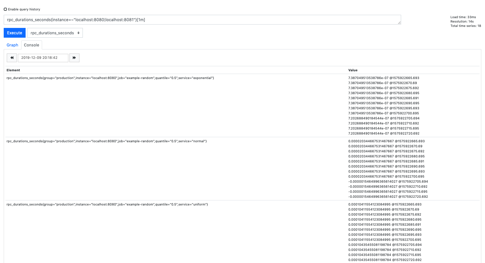

<!-- TOC depthFrom:1 depthTo:6 withLinks:1 updateOnSave:1 orderedList:0 -->

- [Введение](#%D0%B2%D0%B2%D0%B5%D0%B4%D0%B5%D0%BD%D0%B8%D0%B5)
- [История](#%D0%B8%D1%81%D1%82%D0%BE%D1%80%D0%B8%D1%8F)
- [Установка](#%D1%83%D1%81%D1%82%D0%B0%D0%BD%D0%BE%D0%B2%D0%BA%D0%B0)
- [Архитектура](#%D0%B0%D1%80%D1%85%D0%B8%D1%82%D0%B5%D0%BA%D1%82%D1%83%D1%80%D0%B0)
- [Начало работы](#%D0%BD%D0%B0%D1%87%D0%B0%D0%BB%D0%BE-%D1%80%D0%B0%D0%B1%D0%BE%D1%82%D1%8B)
- [Язык запросов](#%D1%8F%D0%B7%D1%8B%D0%BA-%D0%B7%D0%B0%D0%BF%D1%80%D0%BE%D1%81%D0%BE%D0%B2)
	- [Типы данных языка выражений](#%D1%82%D0%B8%D0%BF%D1%8B-%D0%B4%D0%B0%D0%BD%D0%BD%D1%8B%D1%85-%D1%8F%D0%B7%D1%8B%D0%BA%D0%B0-%D0%B2%D1%8B%D1%80%D0%B0%D0%B6%D0%B5%D0%BD%D0%B8%D0%B9)
	- [Селекторы временных рядов](#%D1%81%D0%B5%D0%BB%D0%B5%D0%BA%D1%82%D0%BE%D1%80%D1%8B-%D0%B2%D1%80%D0%B5%D0%BC%D0%B5%D0%BD%D0%BD%D1%8B%D1%85-%D1%80%D1%8F%D0%B4%D0%BE%D0%B2)
		- [Селекторы мгновенные векторов](#%D1%81%D0%B5%D0%BB%D0%B5%D0%BA%D1%82%D0%BE%D1%80%D1%8B-%D0%BC%D0%B3%D0%BD%D0%BE%D0%B2%D0%B5%D0%BD%D0%BD%D1%8B%D0%B5-%D0%B2%D0%B5%D0%BA%D1%82%D0%BE%D1%80%D0%BE%D0%B2)
		- [Селекторы векторов диапазона](#%D1%81%D0%B5%D0%BB%D0%B5%D0%BA%D1%82%D0%BE%D1%80%D1%8B-%D0%B2%D0%B5%D0%BA%D1%82%D0%BE%D1%80%D0%BE%D0%B2-%D0%B4%D0%B8%D0%B0%D0%BF%D0%B0%D0%B7%D0%BE%D0%BD%D0%B0)
		- [Модификатор сдвига](#%D0%BC%D0%BE%D0%B4%D0%B8%D1%84%D0%B8%D0%BA%D0%B0%D1%82%D0%BE%D1%80-%D1%81%D0%B4%D0%B2%D0%B8%D0%B3%D0%B0)
	- [Операторы](#%D0%BE%D0%BF%D0%B5%D1%80%D0%B0%D1%82%D0%BE%D1%80%D1%8B)
- [Использование](#%D0%B8%D1%81%D0%BF%D0%BE%D0%BB%D1%8C%D0%B7%D0%BE%D0%B2%D0%B0%D0%BD%D0%B8%D0%B5)
	- [Prometheus Python Client](#prometheus-python-client)
		- [Установка](#%D1%83%D1%81%D1%82%D0%B0%D0%BD%D0%BE%D0%B2%D0%BA%D0%B0-1)
		- [Примеры](#%D0%BF%D1%80%D0%B8%D0%BC%D0%B5%D1%80%D1%8B)
- [Полезные программы и утилиты](#%D0%BF%D0%BE%D0%BB%D0%B5%D0%B7%D0%BD%D1%8B%D0%B5-%D0%BF%D1%80%D0%BE%D0%B3%D1%80%D0%B0%D0%BC%D0%BC%D1%8B-%D0%B8-%D1%83%D1%82%D0%B8%D0%BB%D0%B8%D1%82%D1%8B)
	- [Grafana](#grafana)
	- [Alertmanager: настройка уведомлений](#alertmanager-%D0%BD%D0%B0%D1%81%D1%82%D1%80%D0%BE%D0%B9%D0%BA%D0%B0-%D1%83%D0%B2%D0%B5%D0%B4%D0%BE%D0%BC%D0%BB%D0%B5%D0%BD%D0%B8%D0%B9)
- [Больше о Prometheus DB](#%D0%B1%D0%BE%D0%BB%D1%8C%D1%88%D0%B5-%D0%BE-prometheus-db)

<!-- /TOC -->

## Введение

Prometheus это `time-series` база данных, использующияся
для мониторинга событий и сигнализации в реальном времени. Проект был
 изначально создан для мониторинга микросервисов.  

 Мониторинг микросервисов является достаточно сложной задачей,
 потому что нужно отслеживать как состояние системы в целом так в
 отдельности каждого микросервиса. Задача усложняется, если
 помимо технических нужно проверять ещё и бизнес-значимые показатели.
 Разработчики Prometheus утверждают, что на рынке не существовало инструментов
 на рынке, позволяющих решать ее без проблем.  

Prometheus представляет собой комплексное решение, в состав которого
входят и фреймворк для мониторинга, и собственная `time-series` база данных.

В этом пособии будут рассказаны такие базовые вещи как, установка базы данных,
ее запуск, рассмотрены базовые возможности, а также приведены несколько примеров
ее использования. Стоит отметить, что автор является хейтером windows os,
а также любителем языка `Python`. Всвязи с этим про работу базы на windows
ничего рассказано не будет, а большенство приведенных примеров будет на языке
`Python`.
Также на официальном [сайте базы данных](https://prometheus.io) можно найти больше
информации о ней, а также докуметацию и туториалы от авторов проекта.

## Базы данных временных рядов

Временные ряды – один из наиболее часто встречающихся в аналитической практике объектов. Временной ряд – это статистика серии наблюдений за одним и тем же явлением, параметром какого-либо процесса,  на протяжении некоторого времени. Каждому результату наблюдения (измерению) соответствует время, когда это наблюдение было сделано, или его порядковый номер – опять же, по шкале времени. Таким образом, при анализе временных рядов учитываются не только базовые статистические закономерности, но и взаимосвязь измерений со временем.

Такого рода данные требуются и накапливаются при самых разных задачах и для самых разных нужд. Можно привести несколько примеров:

* статистика использования сайта (посещения сайта, аппаратных и сетевых ресурсов и т.д.);
* финансовая, биржевая, актуарная статистика;
* макроэкономическая статистика.

## История
Идея создания и разработка Prometheus DB принадлежит
[Matt T. Proud ](https://www.matttproud.com/index.html) и
[Julius Volz](http://juliusv.com/), но большая часть первоначальной разработки
была спонсирована сервисом [SoundCloud](https://soundcloud.com/).
База данных была представлена в 2012 году в качестве внутренней системы
мониторинга SoundCloud, но впоследствии получила широкое распространение.
Первый публичный релиз состоялся в 2015 году, а в качестве подтверждения намерений
стать open-source проектом присоеднился к
[Cloud Native Computing Foundation](https://www.cncf.io) в 2016 году.  

В ноябре 2017 был представлен Prometheus v.2.0, база данных стала быстрее в
накоплении данных и скорости работы, а также повысилась эффективность использования ресурсов.  

Сейчас Prometheus является полностью независимым проектом, поддерживаемый
несколькими крупными компаниями. Каждый может внести свой вклад в разработку,
подрабная инструкция представлена на github
[prometheus](https://github.com/prometheus/prometheus/blob/master/CONTRIBUTING.md).  


## Установка

Для опреационных систем `mac os` и `Linux` установка очень проста. Для начала
переходим на [страницу установки](https://prometheus.io/download/) и скачиваем
 нужный `tar.gz` архив. Затем открываем терминал, преходим в папку с архивом и
 вводим команды:

```{r, engine='bash', count_lines}
  user$ tar xvfz prometheus-*.tar.gz
  cd prometheus-*
```

Мы оказались в корневой папке базы данных и все готово к запуску нашей первой программы.  

Также для дальнейшего прочтения попосбия стоит установить компиляторы для языка
`Go` и  `Python` (на macOS это можно сделать командой `brew install go/python`).

<!-- Для запуска стандартной программы вводим строчку
`./prometheus --config.file=prometheus.yml`, а затем переходим на
[localhost:9090](localhost:9090), также можно посмотреть на метрики и графики
стандртных метрик по ссылкам [localhost:9090/metrics](localhost:9090/metrics) и
[http://localhost:9090/graph](http://localhost:9090/graph). -->


База данных написна на языке `Go`, но также имеет официальные клиентские
библиотеки на языках `Python`, `Java`, `Ruby` и собственно `Go`.

## Архитектура

В состав Prometheus входят следующие компоненты:

* сервер, который считывает метрики и сохраняет их в time series базе данных;
* клиентские библиотеки для различных языков программирования (Go, Java, Python, Ruby; сообществом также созданы библиотеки для Bash, Node.js, Haskell, .NET/C#);
* PROMDASH — дашборд для метрик;
* инструменты для экспорта данных из сторонних приложений (Statsd, Ganglia, HAProxy и других);
* менеджер уведомлений AlertManager (на текущий момент находится на стадии бета-тестирования);
* клиент командной строки для выполнения запросов к данным.  


Главный компонент всей системы — сервер Prometheus. Он работает автономно и сохраняет все данные в локальной базе данных. Обнаружение сервисов происходит автоматически. Это упрощает процедуру развёртывания: для наблюдения за одним сервисом не нужно разворачивать распределённую систему мониторинга; достаточно установить только сервер и необходимые компоненты для сбора и экспорта метрик.
Таких компанентов уже написано много под различные сервисы и ПО, весь список
доступен на [github](https://github.com/prometheus).  

Prometheus хранит данные в виде временных рядов — наборов значений, соотнесённых с временной меткой (timestamp). Элемент временного ряда (измерение) состоит из имени метрики, временной метки и пары «ключ — значение». Временные метки имеют точность до миллисекунд, значения представлены во float64.  

 В Prometheus используются следующие типы метрик:
 * счётчик (counter) — хранит значения, которые увеличиваются с течением времени (например, количество запросов к серверу);
* шкала (gauge) — хранит значения, которые с течением времени могут как увеличиваться, так и уменьшаться (например, объём используемой оперативной памяти или количество операций ввода-вывода);
* гистограмма (histogram) — хранит информацию об изменении некоторого параметра в течение определённого промежутка (например, общее количество запросов к серверу в период с 11 до 12 часов и количество запросов к этому же серверов в период с 11.30 до 11.40);
* сводка результатов (summary) — как и гистограмма, хранит информацию об изменении значения некоторого параметра за временной интервал, но также позволяет рассчитывать квантили для скользящих временных интервалов.


## Начало работы

Начинать работу стоит с прохождения раздела [getting_started started ](https://prometheus.io/docs/prometheus/latest/getting_started/). В нем рассказывается
как установить, задать конфигурацию и использовать Prometheus на простейших
примерах. Установка базы данных была рассмотрена [выше](#Установка), поэтому
в этом разделе будут рассмотрены только простйешие примеры.  

Для начала в файле `prometheus.yml` задааются параметры с которыми запуститься
база данных. Рассмотрим его подробнее:  
```
global:
 scrape_interval:     15s #интервал сбора метрик (по умолчанию — 15 секунд);
 evaluation_interval: 15s #интервал сверки с правилами (по умолчанию — 15 секунд);

 external_labels:
   monitor: 'codelab-monitor'

rule_files:
 - 'prometheus.rules.yml' # файл правил

scrape_configs:
 - job_name: 'prometheus'

   scrape_interval: 5s #переопределение интервал сбора метрик для конкретной джобы

   static_configs: # сервисы и группы сервисов, для которых нужно собирать метрики.
     - targets: ['localhost:9090']
```

Также стоит отметить, что в секции `static_configs` могут быть параметры:  
* scrape_timeout — время ожидания данных;
* metrics_path — HTTP-ресурс, на который будут передаваться метрики;
* scheme — протокол, который будет использоваться для передачи метрик;
* basic_auth — реквизиты для авторизации на сервере, с которого будут собираться метрики (username:, password:).

Подробнее стоит рассказать о фалах-правил. Они выполняются во время сбора данных и позволяют сразу проводить сложные вычисления и сохранить новый временной ряд. Таким образом при каждом обращении, база данных обращается к уже посчитанным данным, что делаеи ее быстрее и эффективнее.  

Вернемся к запуску prometheus. Для запуска необходимо выполнить следующую
команду:
```
./prometheus --config.file=prometheus.yml
```

После запуска переходим на [localhost:9090](localhost:9090) и видим приятный стандартный веб-интерефейс prometheus. Можем выбрать одну из предложенных стандатрных программ prometheus и выполнить ее. Например, `go_memstats_heap_alloc_bytes` и посмотреть сколько выделелось байт на куче.  


Также можно посмотреть на метрики и графики стандртных метрик по ссылкам [localhost:9090/metrics](localhost:9090/metrics) и
[http://localhost:9090/graph](http://localhost:9090/graph).

Для следующих примеров нам понадобиться установленный компилятор языка Go, а также установленный   git в терминале.  

Для начала клонируем исходники с git и собираем их go компилятором следующими командами:  
```
git clone https://github.com/prometheus/client_golang.git
cd client_golang/examples/random
go get -d
go build
```

Далее запускаем в трех различных терминалах 3 следующие примеры (каждый в своем):
```
./random -listen-address=:8080
./random -listen-address=:8081
./random -listen-address=:8082
```

Соотвественно на каждом из трех портов мы можем посмотреть метрики: [http://localhost:8080/metrics](http://localhost:8080/metrics), [http://localhost:8081/metrics](http://localhost:8081/metrics), [http://localhost:8082/metrics](http://localhost:8082/metrics).

Выяглядит все это не очень понятно и интресно и понятно, поэтому давайте настроим конфигурацию prometheus для мониторинга этих метрик. Для этого добавим в наш `prometheus.yml`  файл следующий scrape_configs:

```
scrape_configs:
 - job_name:       'example-random'

	scrape_interval: 5s

	static_configs:
		- targets: ['localhost:8080', 'localhost:8081']
			labels:
				group: 'production'

		- targets: ['localhost:8082']
			labels:
				group: 'canary'
```

После этого снова запускаем команду:
```
./prometheus --config.file=prometheus.yml
```

Также в этом примере показано,  что мы можем добавить группы для нескольких джоб, и затем добавлять лейблы для каждой группы.  

Можем убедиться, что у нас появилась в дашборд prometheus новая метрика `rpc_durations_seconds`.  


## Язык запросов

В Prometheus DB, удивительно, но язык запросов называется PromQL)  

А если серьезно, то Prometheus предоставляет функциональный язык запросов PromQL (Prometheus Query Language), который позволяет пользователю выбирать и агрегировать данные временных рядов в режиме реального времени. Результат выражения может быть отображен в виде графика, отображен в виде табличных данных в браузере выражений Prometheus или использован внешними системами через HTTP API.  

### Типы данных языка выражений
В языке Прометея выражение или подвыражение может являться в одним из четырех типов:

* Мгновенный вектор - набор временных рядов, содержащий одну выборку для каждого временного ряда, все с одной и той же временной меткой
 * Диапазон вектора - набор временных рядов, содержащий диапазон точек данных во времени для каждого временного ряда
* Скаляр - простое числовое значение с плавающей точкой
* String - простое строковое значение(deprecated);  


В зависимости от варианта использования (например, при построении графиков и отображении выходных данных выражения) только некоторые из этих типов можно использовать. Например, выражение, которое возвращает мгновенный вектор, является единственным типом, который может быть непосредственно отображен.  

### Селекторы временных рядов

#### Селекторы мгновенные векторов

Мгновенные селекторы векторов позволяют выбирать набор временных рядов и одно значение выборки для каждого в определенный момент времени: в простейшей форме указывается только имя метрики. Тогда на выходе получается мгновенный вектор, содержащий элементы для всех временных рядов, которые имеют это имя метрики.  

В следующем примере выбираются все временный ряды содеражщие метрик с именем `rpc_durations_seconds` (из раздела #Начало работы) c определенной джобой и состоящей в определенной группе:
```
rpc_durations_seconds{group="production", job="example-random"}
```


Также можно перейти во вкладку `Console` и например посмотреть значения метрик за последнюю минуту с помощью следующей команды:
```
rpc_durations_seconds{group="production", job="example-random"}[1m]
```


Также поддерживается язык регулярных выражений [RE2 syntax](https://github.com/google/re2/wiki/Syntax). Специально для них поддерживаются следующие операторы:
* `=`: Выбирает метки, которые в точности равны указанной строке.
* `!=`: Выбирает метки, которые не равны предоставленной строке.
* `=~`: Выбирает метки, которые соответствуют регулярному выражению предоставленной строки.
* `!~`: Выбирает метки, которые не соответствуют регулярному выражению указанной строки.  

Например можно выполнить следующий запрос, выдающий метрики только с двух хостов:
```
rpc_durations_seconds{instance=~"localhost:8080|localhost:8081"}
```


#### Селекторы векторов диапазона

Работать с векторами диапазона аналогично мгновенным векторов, за исключением того, что они выбирают диапазон выборок в прошлое начиная с текущего момента. Синтаксически, длительность диапазона добавляется в квадратных скобках (`[]`) в конце запроса, чтобы указать, как далеко назад во времени должны выбираться значения для каждого элемента вектора диапазона.  

Продолжительность времени указывается в виде числа, за которым сразу следует одна из следующих единиц измерения:
* s - секунды
* h - часы
* d - дни
* w - недели
* y - года

Можно выполнить следуюзий пример запроса  и посмотреть в консоле значение метрик за порследнюю минуту:  
```
rpc_durations_seconds{instance=~"localhost:8080|localhost:8081"}[1m]
```


#### Модификатор сдвига

Модификатор сдвига(`offset`) позволяет изменять временной сдвиг для отдельных векторов мгновенных значений и диапазонов в запросе.
Например, следующее выражение возвращает значение `rpc_durations_seconds{instance=~"localhost:8080|localhost:8081"}`, которое было 5 минут назад относительно текущего момента времнни:

```
rpc_durations_seconds{group="production", job="example-random"} offset 5m
```


Нужно иметь ввиду, что `offset` нужно указывать сразу после слектора, как например в таком запросе, возращающий сумму мтерик 5 минут назад:
```
sum(rpc_durations_seconds{group="production", job="example-random"} offset 5m)
```
Результаты предыдущего запроса посмотрите самостоятельно.

### Операторы

Подробно про операторы можно почитать [документации](https://prometheus.io/docs/prometheus/latest/querying/operators/)

Кратко: поддерживаются бинарные и арифметически между:
* двумя числами
* мгновенным вектором и числом
* между двумя мгновенными векторами

Первые два очевидно как работают, приведем пример для третьего пункта. Важно, что возможны операции только между векторами с одинаковыми метками. Если необходимо оперировать векторами с различными метками, то используется ключевое слово `ignore`, чтобы не учитывать конкретную метку. Собственно запрос и результат его выполнения:
```
rpc_durations_seconds{instance="localhost:8081"}  / ignoring(instance) rpc_durations_seconds{instance="localhost:8080"}
```


## Использование

Prometheus предоставляет официальные клиентские библитеки на четырех языках:

* Go
* Java or Scala
* Python
* Ruby

А также существуют нефоциальные клиентские библиотеки практически на всех языкахпрограммирования. Подробнее о них можно узнать по на . Более того если ни одна из предложенных библитек не устравет или не существует под необходимый язык, то можно написать свою.  

В этом разделе будет рассмотрена библиотека на языке Python.

### Prometheus Python Client

#### Установка
Все очень просто)))  

```
pip install prometheus_client
```

#### Примеры

Копируем этот шикарный питновский код и запускаем.

```python
from prometheus_client import start_http_server, Summary
import random
import time

# Создаем метрику
REQUEST_TIME = Summary('request_processing_seconds', 'Time spent processing request')

# Магический декоратор над функцией
@REQUEST_TIME.time()
def process_request(t):
    """A dummy function that takes some time."""
    time.sleep(t)

if __name__ == '__main__':
    # Выбираем где запускаем
    start_http_server(8000)
    # Генерируем данные
    while True:
        process_request(random.random())
```

Посещаем шикарный [http://localhost:8000/](http://localhost:8000/).  
Видим, что появились новые метрики:
* `request_processing_seconds_count`: количество вызовов функции.
* `request_processing_seconds_sum`: общее количество времени, которое выполнялась функция.


## Полезные программы и утилиты

### Grafana

В первую очередь стоит упоменуть о совместимости Prometheus и отличного грфического визуолизатора . Установить ее можно по 


По умолчанию Grafana запускается на http://localhost:3000.

**Создание источника данных для Prometheus:**

355/5000
* Нажмите на логотип Grafana, чтобы открыть меню боковой панели.
* Нажмите «Data Sources» на боковой панели.
* Нажмите «Add New».
* Выберите Prometheus в качестве типа.
* Установите соответствующий URL-адрес сервера Prometheus (например, http: // localhost: 9090 /)
* При необходимости настройте другие параметры источника данных (например, отключите доступ к прокси-серверу).
Нажмите «Add», чтобы сохранить новый источник данных.

Ниже приведен пример конфигурации:


**Создание визуализации Prometheus:**

* Нажмите на название графика, затем нажмите «Edit».
* На вкладке «Metrics» выберите источник данных Prometheus (справа внизу).
* Введите любое выражение Прометея в поле «Query», используя поле «Metric» для поиска метрик с помощью автозаполнения.
* Чтобы отформатировать имена легенды временных рядов, используйте вход «ФLegend format». Например, чтобы показать только метки метода и состояния возвращаемого результата запроса, разделенные чертой, можно использовать строку формата легенды `{{method}} - {{status}}`.
* Настройте другие параметры графика, пока у вас не будет рабочего графика.

Посмотрим на пример как может выглядить визуализация:


**Использование готовых дэшборд с Grafana.com:**

Grafana.com поддерживает коллекцию общих панелей мониторинга, которые можно загружать и использовать с отдельными экземплярами Grafana. Используйте опцию «Filter» на Grafana.com, чтобы просматривать информационные панели только для источника данных «Prometheus».

В настоящее время вы должны вручную отредактировать загруженные файлы JSON и исправить записи источника данных:, чтобы они отражали имя источника данных Grafana, которое вы выбрали для своего сервера Prometheus. Используйте «Dashboards» → «Home» → «Import», чтобы импортировать отредактированный файл панели мониторинга в вашу установку Grafana.

### Alertmanager: настройка уведомлений

Ни один инструмент мониторинга немыслим без компонента для рассылки уведомлений. В Prometheus для этой цели используется alertmanager. Настройки уведомлений хранятся в конфигурационном файле alertmanager.conf.
Рассмотрим следующий фрагмент:

```
notification_config {
  name: "alertmanager_test"
  email_config {
    email: "test@example.org"
  }

aggregation_rule {
  notification_config_name: "alertmanager_test"
}
```

Его синтаксис вполне понятен: мы указали, что уведомления при наступлении определённого условия нужно отправлять по электронной почте на адрес test@example.org.

В конфигурационный файл можно добавлять ссылки на файлы правил (по сути они ничем не отличаются от файлов правил для сбора метрик, описанных выше). В правилах прописываются условия, при которых нужно отправлять уведомления.

В общем виде синтаксис правила выглядит так:

``` python
ALERT <имя проверки>
  IF <параметр и его значение>
  FOR <период времени>
  WITH <набор меток>>
  SUMMARY "<краткое описание>"
  DESCRIPTION "<образец уведомления>"


```

Рассмотрим функции правил на более конкретных примерах.
Пример1:

``` python
ALERT InstanceDown
  IF up == 0
  FOR 5m
  WITH {
    severity="page"
  }
  SUMMARY "Instance {{$labels.instance}} down"
  DESCRIPTION "{{$labels.instance}} of job {{$labels.job}} has been down for more than 5 minutes."
```

Это правило указывает, что уведомление нужно отправлять в случае, если некоторый инстанс недоступен в течение 5 минут и более.

Пример2:

``` python
ALERT ApiHighRequestLatency
  IF api_http_request_latencies_ms{quantile="0.5"} > 1000
  FOR 1m
  SUMMARY "High request latency on {{$labels.instance}}"
  DESCRIPTION "{{$labels.instance}} has a median request latency above 1s (current value: {{$value}})"
```

Согласно этому правилу, уведомления нужно посылать, как только среднее время ответа на запросы к API превысит 1 мс.

Чтобы прописанные в конфигурационном файле настройки вступили в силу, нужно сохранить его и выполнить команду:

```
$ alertmanager -config.file alertmanager.conf
```

Можно создать несколько конфигурационных файлов и прописать в них настройки уведомлений для различных случаев.

Уведомления Prometheus отправляет в формате JSON. Выглядят они примерно так:

``` JSON
{
   "version": "1",
   "status": "firing",
   "alert": [
      {
         "summary": "summary",
         "description": "description",
         "labels": {
            "alertname": "TestAlert"
         },
         "payload": {
            "activeSince": "2015-06-01T12:55:47.356+01:00",
            "alertingRule": "ALERT TestAlert IF absent(metric_name) FOR 0y WITH ",
            "generatorURL": "http://localhost:9090/graph#%5B%7B%22expr%22%3A%22absent%28metric_name%29%22%2C%22tab%22%3A0%7D%5D",
            "value": "1"
         }
      }
   ]
}
```

## Безопасность


## Больше о Prometheus DB

Больше о Prometheus можно узнать на официальном сайте [prometheus](https://prometheus.io/)

## Сообщество

### Социальные сети

Prometheus имеет активное развивающиеся сообщество.   
Вот некоторые из каналов, которые мы используем для общения о Prometheus:
* [prometheus-announce](https://groups.google.com/forum/#!forum/prometheus-announce) – для объявлений, о новых версиях.
* [prometheus-users](https://groups.google.com/forum/#!forum/prometheus-users) - для обсуждения вопросов использования Прометея и поддержки сообщества.  

Twitter: [@PrometheusIO](https://twitter.com/PrometheusIO)  


### Саммиты разработчиков:

Технические обсуждения происходят в списке разработчиков, наши личные встречи встречаются публично, и у нас есть публичные звонки. Ниже вы можете найти ссылки на наши саммиты разработчиков на PromCon 2017 и 2018 соответственно. Эти встречи на высшем уровне разработчиков открыты для присоединения по запросу, если у нас есть возможности. Предпочтение отдается дружественным проектам и компаниям, плюс разнообразие. Посетители могут свободно не быть указанными в записях публичных собраний.

* [2017 developer summit notes](https://docs.google.com/document/d/1DaHFao0saZ3MDt9yuuxLaCQg8WGadO8s44i3cxSARcM)
* [2018 developer summit notes](https://docs.google.com/document/d/1-C5PycocOZEVIPrmM1hn8fBelShqtqiAmFptoG4yK70)
* [2019 developer summit notes](https://docs.google.com/document/d/1NQIX78nwBhfLZD3pAb0PK-uBKYqnkzjjVhOQ-kIaEGU)
* [2019 developer summit 2 notes](https://docs.google.com/document/d/1VVxx9DzpJPDgOZpZ5TtSHBRPuG5Fr3Vr6EFh8XuUpgs)

### Contributing
 В файле `CONTRIBUTING.md` в соответствующем репозитории Prometheus для получения инструкций о том, как отправить изменения. Если вы планируете внести более сложные или потенциально противоречивые изменения, обсудите их в IRC-канале разработчиков или в списке рассылки перед отправкой запроса на удаление.

IRC: `#prometheus-dev` on [irc.freenode.net](irc.freenode.net)  
Мейлы разработчиков: [prometheus-developers](https://groups.google.com/forum/#!forum/prometheus-developers)
##
